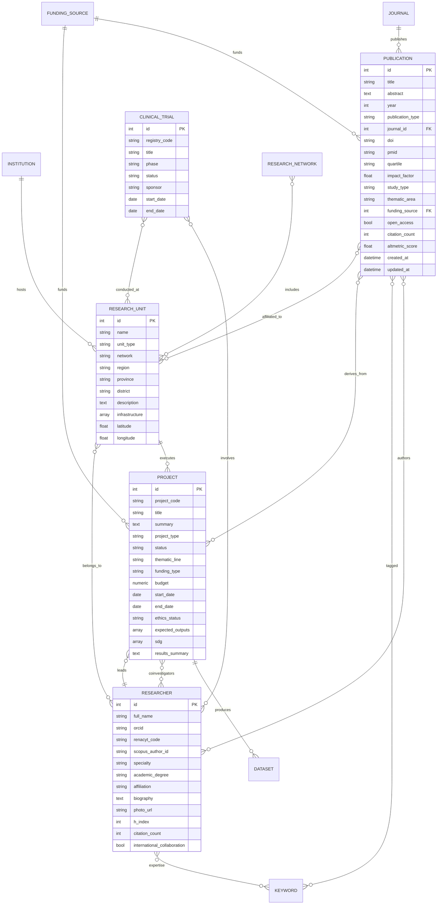

# Arquitectura de datos y backend CRIS

## Alcance

El backend modela el nucleo funcional del Observatorio Nacional de Investigacion de EsSalud para:

- Produccion cientifica
- Investigadores
- Proyectos
- Unidades de investigacion
- Ensayos clinicos
- Financiamiento, revistas, instituciones, palabras clave, redes y datasets

## Entidades principales

- `Publication`: produccion cientifica con DOI, PMID, cuartil, impacto, citas y altmetric.
- `Researcher`: perfiles CRIS con ORCID, RENACYT, Scopus Author ID, afiliacion y metricas.
- `Project`: portafolio institucional con IP, coinvestigadores, presupuesto, estado etico y ODS.
- `ResearchUnit`: capacidades por red asistencial, region, infraestructura y geolocalizacion.
- `ClinicalTrial`: ensayos clinicos por registro, fase, sponsor, unidades e investigadores.
- `FundingSource`: fuentes de financiamiento institucional, publico competitivo o cooperacion.
- `Journal`: revistas con ISSN, area, cuartil e impacto.
- `Institution`: hospitales y entidades vinculadas.
- `Keyword`: vocabulario controlado para busqueda y clasificacion.
- `ResearchNetwork`: redes cientificas e institucionales.
- `Dataset`: activos de datos vinculables a proyectos.

## Diagrama ER

## OpenSearch futuro

El endpoint `/api/search` mantiene un contrato independiente del motor:

- `entity`
- `id`
- `title`
- `subtitle`
- `url`

La proxima iteracion puede reemplazar la busqueda en memoria por un servicio `SearchProvider` con implementaciones `PostgresSearchProvider` y `OpenSearchProvider`.
